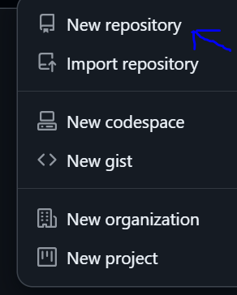
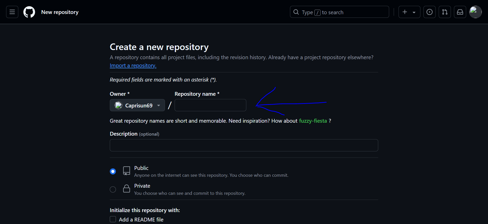
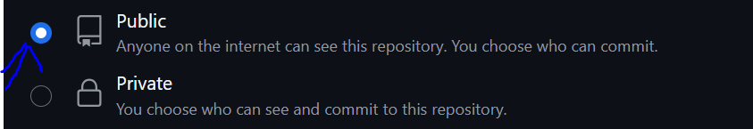

# Github guide on how to create a repository through github and through CLI

# How to create a Repository via github 

- **Step 1** 

    Sign in to your github account and click on the add button at the top right corner 

**Step 2** 
    Select new repository from the drop down menu 

**Step 3**
    Fill in your repository details 

**To fill in the details:**
    - On the create new repository page, choose a name for your repository 
    - You can add a description if you want 
    -You can make your repository public or private. Choose public if you want others to see your repository.Choose private to keep it hidden.
    -Check Add a README file to include a README file immediately. This is helpful if you're starting from scratch.
    -Click on the create repository button to create the repository, 

    Repository creation complete ;)

# How to create a repository via CLI

**Step 1**

    Ensure the github CLI is installed on your system 

-   **On Windows**: Download from [GIthubclireleases](https://cli.github.com/)
-   **On macOS (Homebrew)**: Type "brew install gh" in your command line.

-   **On linux(Debian\Ubuntu)** : Type "sudo apt update" then type "sudo apt install gh"

To confirm installation,run : "gh --version"

**Step 2:  Authenticate github CLI**

    Before creating repositories, log in to GitHub via the CLI: Type the command "gh auth login"

    Follow the prompts:

    - Choose GitHub.com as the service.
    - Authenticate via your browser or by     providing a token.

**Step 3: Create a repository**

    - Run the following command to create a new repository:
     "gh repo create<repository name>"

    - You can use the following additional commands while creating the repistories

    1. --public: Make the repository public.
    2. --private: Make it private.
    3. --clone: Clone the repository locally after creation.
    4. --description "My first repository": Add a description.

**Step 4: Verify the Repository**

    Once the repository is created, you’ll see the repository URL in the output.

    To verify the repository was created, you can open it in your browser:

    - Type the following command to open it:
    "gh repo view <repository-name> --web"

**This is a simple guide on how to create a github repository using github and commandline.**

    

    

